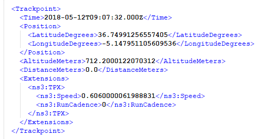

# Ejercicio: Análisis de rutas GPS
**Autor**: José A. Troyano  **Revisores**: Mariano González, Miguel Toro, Fermín Cruz, Toñi Reina.   ****Última modificación:** 19/11/2023

Las rutas GPS (también llamadas _tracks_) contienen información sobre los puntos de un determinado trayecto. Casi cualquier dispositivo que tenga GPS (móviles, relojes, pulseras fitbit, ...) permite registrar esta información. Existen varios formatos para representar rutas como, por ejemplo, <code>TCX</code>, <code>GPX</code>, <code>KML</code>, <code>GDB</code>, ... 

Para no complicar el ejercicio con la lectura de un formato complejo, trabajaremos con un formato simple: <code>CSV</code>. Los datos que acompañan el ejercicio se corresponden con una ruta real en formato <code>TCX</code> que ha sido procesada para extraer solo los valores que usaremos en el ejercicio. El formato <code>TCX</code> está basado en <code>XML</code>, contiene más información y es bastante más complejo que el formato con el que trabajaremos. He aquí, a modo de curiosidad, un fragmento del fichero <code>TCX</code> del que se han extraido los datos de entrada: 





Para implementar algunas de las funciones que nos hacen falta, haremos uso de utilidades disponibles en la librería estándar de Python y en el paquete <code>matplotlib</code>. Para ello, antes de empezar, deberemos importar los siguientes elementos:


```python
import csv
from datetime import datetime, time
from math import sin, cos, sqrt, atan2, radians
from matplotlib import pyplot as plt
from matplotlib import image as mpimg
from typing import NamedTuple
```

## 1. Carga de datos

El formato de entrada con el que trabajaremos contempla una línea por cada punto del trayecto que incluye cuatro informaciones:

- <code>tiempo</code> en el que fue tomada la medición
- <code>latitud</code> del punto en el que fue tomada la medición
- <code>longitud</code> del punto en el que fue tomada la medición
- <code>altitud</code> del punto en el que fue tomada la medición

He aquí un fragmento de dicho fichero con las cinco primeras líneas:

<pre>
     00:00:00,36.74991256557405,-5.147951105609536,712.2000122070312
     00:00:30,36.75008556805551,-5.148005923256278,712.7999877929688
     00:01:30,36.75017642788589,-5.148165263235569,714.0
     00:02:04,36.750248931348324,-5.148243047297001,714.5999755859375
     00:02:19,36.750430315732956,-5.148255117237568,715.0
</pre>

### 1.1 Función de lectura

La siguiente función será la encargada de leer el fichero de entrada, y construir a partir de él una estructura de datos en memoria. Usaremos una lista de <code>namedtuple</code> de tipo Punto para almacenar todos los puntos que contiene una ruta. Fíjate que la nametuple `Punto` está definida en base a otra `namedtuple` `Coordenadas3D`. Define `Punto` en un módulo llamado `gps.py` y `Coordenadas3D` en un módulo `coordenadas3D.py`.


```python
# Creación de un tipo 'namedtuple' para los puntos
Punto = NamedTuple('Punto', [('tiempo', datetime.time), ('coordenadas', Coordenadas3D)])

Coordenadas3D = NamedTuple ('Coordenadas3D',
                            [('latitud', float), ('longitud',float), ('altitud',float)])

```
Implementa la función `lee_puntos` en el módulo `gps.py` con la siguiente especificación. Ten en cuenta que para convertir una cadena con el formato HH:MM:SS en un objeto de tipo'time' puedes usar la siguiente expresión:
    
```python
        datetime.strptime(tiempo,'%H:%M:%S').time()
```

```python
def lee_puntos(fichero:str)->List[Punto]:
    '''Devuelve una lista de los puntos de un trayecto almacenadas en un archivo
    csv.

    :param fichero: Nombre y ruta del archivo csv
    :type fichero: str
    :return: Lista de puntos del trayecto
    :rtype: List[Punto]
    '''
    pass
```
El test de la función lee_puntos debe dar el siguiente resultado:
```
Hay 5538 puntos en el trayecto
Los 5 primeros puntos son:
        1-Punto(tiempo=datetime.time(0, 0), coordenadas=Coordenadas3D(latitud=36.74991256557405, longitud=-5.147951105609536, altitud=712.2000122070312))
        2-Punto(tiempo=datetime.time(0, 0, 30), coordenadas=Coordenadas3D(latitud=36.75008556805551, longitud=-5.148005923256278, altitud=712.7999877929688))
        3-Punto(tiempo=datetime.time(0, 1, 30), coordenadas=Coordenadas3D(latitud=36.75017642788589, longitud=-5.148165263235569, altitud=714.0))
        4-Punto(tiempo=datetime.time(0, 2, 4), coordenadas=Coordenadas3D(latitud=36.750248931348324, longitud=-5.148243047297001, altitud=714.5999755859375))
        5-Punto(tiempo=datetime.time(0, 2, 19), coordenadas=Coordenadas3D(latitud=36.750430315732956, longitud=-5.148255117237568, altitud=715.0))
```
## 2. Funciones de transformación y filtrado

En esta sección implementaremos distintas funciones de filtrado, consulta y cálculo de nuevas informaciones, que nos servirán para obtener diversos indicadores sobre el trayecto analizado.

### 2.1. Filtrado por tiempos

La primera de las funciones se llama <code>filtra_por_tiempo</code> y nos permitirá extraer un fragmento del trayecto dados dos instantes de tiempo. Implementa esta función en el módulo `gps` y su correspondiente test en el módulo `gps_test.py`, con la siguiente especificación:

```python
def filtra_por_tiempo(trayecto:List[Punto], inicio:datetime.time, fin:datetime.time)->List[Punto]:
    '''Devuelve una lista con los puntos del trayecto del intervalo de tiempo [inicio, fin).

    :param trayecto: Lista de puntos del trayecto
    :type trayecto: List[Punto]
    :param inicio: Hora inicial del intervalo
    :type inicio: datetime.time
    :param fin: Hora final del intervalo
    :type fin: datetime.time
    :return: Lista de puntos del subtrayecto del intervalo [inicio, fin)
    :rtype: List[Punto]
    '''
```
Implementa pruebas para obtener los puntos de los intervalos [00:00:00,11:48:00) y [11:48:01,23:36:00). El resultado de las mismas debe ser similar a la siguiente salida:

```
Test filtra_por_tiempo========================================
El subtrayecto del intervalo temporal [00:00:00,11:48:00) tiene 3112 puntos
Los 5 primeros puntos son:
        1-Punto(tiempo=datetime.time(0, 0), coordenadas=Coordenadas3D(latitud=36.74991256557405, longitud=-5.147951105609536, altitud=712.2000122070312))
        2-Punto(tiempo=datetime.time(0, 0, 30), coordenadas=Coordenadas3D(latitud=36.75008556805551, longitud=-5.148005923256278, altitud=712.7999877929688))
        3-Punto(tiempo=datetime.time(0, 1, 30), coordenadas=Coordenadas3D(latitud=36.75017642788589, longitud=-5.148165263235569, altitud=714.0))
        4-Punto(tiempo=datetime.time(0, 2, 4), coordenadas=Coordenadas3D(latitud=36.750248931348324, longitud=-5.148243047297001, altitud=714.5999755859375))
        5-Punto(tiempo=datetime.time(0, 2, 19), coordenadas=Coordenadas3D(latitud=36.750430315732956, longitud=-5.148255117237568, altitud=715.0))
Test filtra_por_tiempo========================================
El subtrayecto del intervalo temporal [11:48:01,23:36:00) tiene 2426 puntos
Los 5 primeros puntos son:
        1-Punto(tiempo=datetime.time(11, 48, 6), coordenadas=Coordenadas3D(latitud=36.82379828765988, longitud=-5.201733587309718, altitud=687.2000122070312))
        2-Punto(tiempo=datetime.time(11, 48, 21), coordenadas=Coordenadas3D(latitud=36.82364238426089, longitud=-5.2016189228743315, altitud=688.0))
        3-Punto(tiempo=datetime.time(11, 48, 36), coordenadas=Coordenadas3D(latitud=36.82349276728928, longitud=-5.201481794938445, altitud=690.4000244140625))
        4-Punto(tiempo=datetime.time(11, 48, 52), coordenadas=Coordenadas3D(latitud=36.823339965194464, longitud=-5.201335027813911, altitud=692.7999877929688))
        5-Punto(tiempo=datetime.time(11, 49, 8), coordenadas=Coordenadas3D(latitud=36.823198311030865, longitud=-5.201185578480363, altitud=694.5999755859375))
```

### 2.2. Cálculo de distancias entre dos coordenadas geográficas

Para que calcular la distancia (en kilómetros) entre dos coordenadas geográficas especificadas mediante latitud y longitud se puede usar la distancia <a href= 'https://es.wikipedia.org/wiki/F%C3%B3rmula_del_haversine'>haversine</a>. Implementa la función <code>distancia_haversine</code> en el módulo `coordenadas3D.py`, teniendo en cuenta que
la distancia haversine entre dos puntos, con coordenadas en radianes $(lat1, lon1)$ y $(lat2, lon2)$, se calcula con la siguiente fórmula, donde $R$ es el radio de la tierra en kilómetros, cuyo valor es $6371$. 

$Δlat = lat2− lat1$

$Δlon = lon2− lon1$

$a = sin²(Δlat/2) + cos(lat1) · cos(lat2) · sin²(Δlon/2)$

$d = 2 · R · asin(\sqrt {a})$

```python
def distancia_haversine(coordenadas1:Coordenadas3D, coordenadas2: Coordenadas3D)->float:
    '''Calcula la distancia haversine entre dos puntos, dados por su latitud y longitud

    :param coordenadas1: Coordenadas del primer punto
    :type coordenadas1: Coordenadas3D
    :param coordenadas2: Coordenadas del segundo punto
    :type coordenadas2: Coordenadas3D
    :return: Distancia haversine
    :rtype: float
    '''
    pass
```
Para convertir las coordenadas a radianes implementa la función `a_radianes` en el módulo `coordenadas3D.py` con las siguiente especificación. Puedes usar la función `radians` del módulo `math` para convertir grados a radianes.

```python
def a_radianes(c:Coordenadas3D)->Coordenadas3D:
    '''Devuelve una nueva coordenada con la latitud y longitud de la coordenada
    dada como parámetro convertida en radianes. La altitud es la misma que
    la coordenada original

    :param c: Coordenada con la latitud y la longitud en grados
    :type c: Coordenadas3D
    :return: Una coordenada en la que la latitud y la longitud está en radianes
    :rtype: Coordenadas3D
    '''
    pass
```
Implementa un método de test en el módulo `coordenadas3D_test` y e invócalo para calcular la distancia haversine entre Sevilla y Cádiz, teniendo en cuenta que su latitud y longitud son, respectivamente(37.3828300, -5.9731700) y (36.5008762, -6.2684345). El resultado debe ser similar al siguiente:

```
La distancia haversine entre Coordenadas3D(latitud=37.38283, longitud=-5.97317, altitud=0) y Coordenadas3D(latitud=36.5008762, longitud=-6.2684345, altitud=0) es 101.5186094973208

```

La función <code>distancia_haversine</code> no tiene en cuenta la diferencia de altitud al calcular la distancia entre dos coordenadas. Para ello, implementaremos la función <code>distancia_haversine_3d</code> apoyándonos en el teorema de Pitágoras:

$$
distancia\_3d = \sqrt{(distancia\_2d)^2 + (incremento\_altitud)^2}
$$
Para ello sigue los pasos:
    - Calcula la diferencia de altitud de los dos puntos (en kilómetros)
    - Calcula la distancia_haversine de los dos puntos
    - Usa ambos valores y el teorema de Pitágoras para calcular la distancia haversine_3d
```python
def distancia_haversine_3d(coord_a, coord_b):
    '''Calcula la distancia haversine entre dos puntos, teniendo en cuenta la altitud mediante el teorema de pitágoras.

    :param coordenadas1: Coordenadas del primer punto
    :type coordenadas1: Coordenadas3D
    :param coordenadas2: Coordenadas del segundo punto
    :type coordenadas2: Coordenadas3D
    :return: Distancia haversine en km, teniendo en cuenta la altitud
    :rtype: float
    '''
    pass
```
Implementa en el módulo `coordenadas3D.py` una función de test para probar la distancia harvesine 3D. Usa las coordenadas (36.74991256557405,-5.147951105609536,712.2000122070312) y  (36.75008556805551,-5.148005923256278,712.7999877929688). El resultado debe ser similar al siguiente:

```
La distancia haversine 3D entre Coordenadas3D(latitud=36.74991256557405, longitud=-5.147951105609536, altitud=712.2000122070312) y Coordenadas3D(latitud=36.75008556805551, longitud=-5.148005923256278, altitud=712.7999877929688) es 0.019856371974476615
```

### 2.3. Distancia y velocidad por trayecto

En esta sección implementaremos dos funciones para calcular, respectivamente, la distancia y la velocidad en un determinado trayecto. Implementa ambas funciones en el módulo `gps.py` según las siguientes especificicaciones:


```python
def distancia_trayecto(trayecto:List[Punto])->float:
    '''Devuelve la distancia total de todos los puntos del trayecto

    :param trayecto: Lista de puntos del trayecto
    :type trayecto: List[Punto]
    :return: Distancia total del trayecto
    :rtype: float
    '''
    pass
```
Implementa una función de test en el módulo `gps_test.py`. Prueba usando un trayecto con todos los puntos leídos del archivo csv y con un trayecto formado por los 10 primeros puntos del leídos del archivo csv. El resultado debe ser similar al siguiente:

```
La distancia total del trayecto con 5538 puntos es 100.9165110795849
La distancia total del trayecto con 10 puntos es 0.1731767659844953
```

Para calcular la velocidad media del trayecto calcula la distancia total y la duración, en horas, del trayecto. Para calcular la duración toma el punto inicial y el punto final del trayecto y calcula su diferencia. Como en python no se pueden restar objetos de tipo time, crea una fecha a partir de la fecha de hoy y la hora del punto del trayecto de la siguiente forma:

```python  
    fecha_inicio = datetime.combine(hoy, hora_inicio)
    fecha_fin = datetime.combine(hoy, hora_fin)
```
resta luego las fechas y obtendras como resultado un objeto de tipo `deltatime`. Puedes acceder a los segundos usando su campo seconds. Sólo tendrás que dividir entre 3600 para obtener la duración en horas, de la siguiente forma:

```python
duracion = (fecha_fin - fecha_inicio).seconds/3600
```

```python
def velocidad_media_trayecto(trayecto:List[Punto])->float:
    '''Devuelve la velocidad media (en km/h) del trayecto dado como parámetro.

    :param trayecto: Lista de puntos del trayecto
    :type trayecto: List[Punto]
    :return: la velocidad media en km/h durante el trayecto
    :rtype: float
    '''
    pass
```
Implementa una función de test en el módulo `gps_test.py`. Prueba usando un trayecto con todos los puntos leídos del archivo csv y con un trayecto formado por los 10 primeros puntos del leídos del archivo csv. El resultado debe ser similar al siguiente:

```
La velocidad media del trayecto con 5538 puntos es 4.4679683181634395
La velocidad media del trayecto con 10 puntos es 3.0117698432086137
```

### 2.4. Desnivel acumulado

La función de consulta <code>desnivel_acumulado</code> calcula, a partir de un trayecto, una tupla con dos informaciones:
- **Desnivel acumulado de subida**: suma de la altitud ganada en todos los intervalos de subida.
- **Desnivel acumulado de bajada**: suma de la altitud perdida en todos los intervalos de bajada.

El desnivel entre dos puntos se calcula como la diferencia de las alturas de esos dos puntos. Si la diferencia es positiva, se ha ganado altitud y si la diferencia es negativa se ha perdido altitud. Por lo tanto, para resolver el ejercicio calcule las diferencias de altitudes entre cada dos puntos consecutivos del trayecto, y luego calcule, por una parte la suma de las diferencias que son mayores que cero, y por otra, la suma de las diferencias que son menores que cero.

```python
def desnivel_acumulado(trayecto:List[Punto])->Tuple[float, float]:
    '''Devuelve una tupla con los desniveles acumulados de subida y de bajada

    :param trayecto:Lista de puntos del trayecto
    :type trayecto: List[Punto]
    :return: Una tupla con los desniveles acumulados de subida y bajada
    :rtype: Tuple[float, float]
    '''
    pass
```
Implementa una función de test en el módulo `gps_test.py`. Prueba usando un trayecto con todos los puntos leídos del archivo csv y con un trayecto formado por los 10 primeros puntos del leídos del archivo csv. El resultado debe ser similar al siguiente:

```
Los desniveles acumulados del trayecto con 5538 puntos son:
 subida: 3233.400634765625 bajada: -3222.400634765625
Los desniveles acumulados del trayecto con 10 puntos son:
 subida: 8.79998779296875 bajada: 0
```

## 3. Funciones de visualización

En esta sección implementaremos tres funciones de visualización que permitirán mostrar de forma gráfica aspectos interesantes del trayecto analizado.

### 3.1. Perfil del trayecto

Para generar la gráfica se usarán las siguientes instrucciones:
    ```python
        plt.title(titulo)
        plt.xlabel(etiqueta_eje_x)
        plt.ylabel (etiqueta_eje_y)    
        plt.plot(kilometros,altitudes)
        plt.show()
    ```
Donde:
    - titulo: es una cadena con título del gráfico
    - etiqueta_eje_x: es una cadena con la etiqueta que aparecerá en el eje x
    - etiqueta_eje_y: es una cadena con la etiqueta que aparecerá en el eje y
    - kilometros: es una lista con las distancias (en km) de cada punto al inicio del trayecto, 
    - altitudes: lista con las altitudes de cada punto del trayecto
        
Para 'kilometros' se recomienda un esquema acumulativo de O(n), ya que la versión por compresión  (usando la función 'distancia_trayecto') sería de O(n^2). Con varios miles de puntos esto se traduce en un cálculo bastante lento.

```python
def mostrar_perfil(trayecto:List[Punto])->None:
    '''Toma como entrada un trayecto definido por una lista de puntos y produce como salida
    el perfil del trayecto. En el eje X se muestran los kilómetros y en el eje Y las alturas
    de los distintos puntos (en metros).

    :param trayecto: Lista de puntos del trayecto
    :type trayecto: List[Punto]
    '''
    pass
```

Implementa una función de test en el módulo `gps_test.py`. Prueba usando un trayecto con todos los puntos leídos del archivo csv, el resultado debe ser una gráfica similar a la siguiente:


### 3.2. Velocidad por intervalos

Para generar la gráfica se usarán las siguientes instrucciones:
    ```python
        plt.title(titulo)
        plt.xlabel(etiqueta_eje_x)
        plt.ylabel (etiqueta_eje_y)    
        plt.plot(kilometros, velocidades)
        plt.show()
    ```

Para 'kilometros' se recomienda un esquema acumulativo de O(n), ya que la versión por compresión (usando la función 'distancia_trayecto') sería de O(n^2). Con varios miles de puntos esto se traduce en un cálculo bastante lento.

```python
def mostrar_velocidad_por_intervalo(trayecto:List[Punto])->None:
    '''Toma como entrada un trayecto definido por una lista de puntos y produce como salida
    una gráfica con la velocidad en cada punto del trayecto. En el eje X se muestran los 
    kilómetros recorridos y en el eje Y las velocidades (en km/h).

    :param trayecto: Lista de puntos del trayecto
    :type trayecto: List[Punto]
    '''
    pass
```

Implementa una función de test en el módulo `gps_test.py`. Prueba usando un trayecto con todos los puntos leídos del archivo csv, el resultado debe ser una gráfica similar a la siguiente:


### 3.3. Ruta en el mapa

Para dibujar la ruta en el mapa, vamos a usar la librería `folium` que hemos usado en los proyectos Sevici y Centros Sanitarios. En el módulo `mapas.py`, que se le proporciona ya implementado, tienes implementadas las funciones `crea_mapa`, `crea_marcador` y `guarda_mapa`, que ya has usado en los proyectos Sevici y Centros Sanitarios. Además de esta funciones, tienes la función `crea_polilinea` que dada una lista de tuplas con la latitud y longitud de puntos en el plano, dibuja en el mapa una polilínea que tiene como vértices cada uno de los puntos de la lista. 

Para dibujar la ruta en el mapa haz lo siguiente:
1. Crea un mapa que tenga como centro las coordenadas del primer punto del trayecto.
2. Agrega al mapa una polilínea con todos los puntos del trayecto y que sea de color azul.
3. Añade un marcadador en la coordenada correspondiente al primer punto del trayecto. Ponle como etiqueta "Inicio" y dibújalo en rojo.
4. Añade un marcadador en la coordenada correspondiente al último punto del trayecto. Ponle como etiqueta "Fin" y dibújalo en verde.
5. Guarda el mapa.

 ```python
def mostrar_ruta_en_mapa (trayecto:List[Punto], archivo_html:str)->None:
   '''Toma como entrada un trayecto definido por una lista de puntos y el nombre de un archivo
    html y genera un archivo html con un mapa interactivo en el que está dibujada
    la ruta. El mapa también muestra dos marcadores, uno para el inicio de la ruta y 
    otro para el final de la ruta.

    :param trayecto: Lista de puntos del trayecto
    :type trayecto: List[Punto]
    :param archivo_html: Nombre y ruta del archivo html a generar.
    :type archivo_html: str
    '''
    pass
```

Implementa una función de test en el módulo `gps_test.py`. Prueba usando un trayecto con todos los puntos leídos del archivo csv, y crea un archivo llamado `trayecto.html` en la carpeta `out`:


